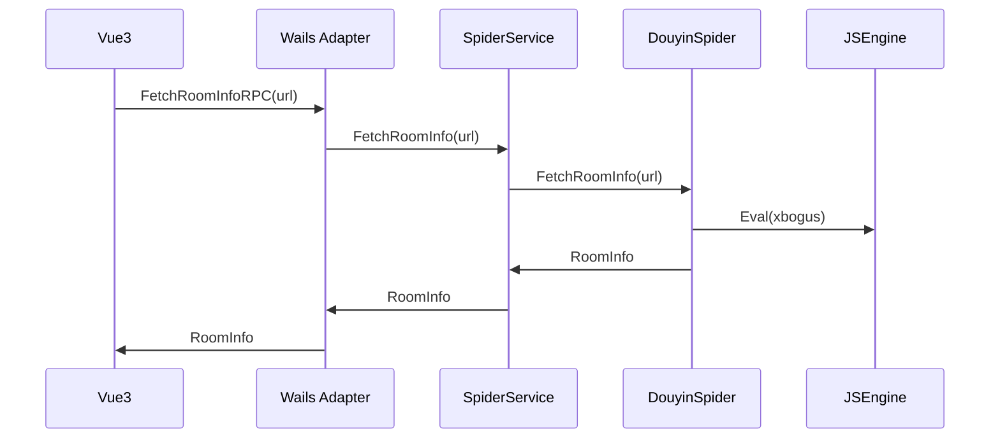
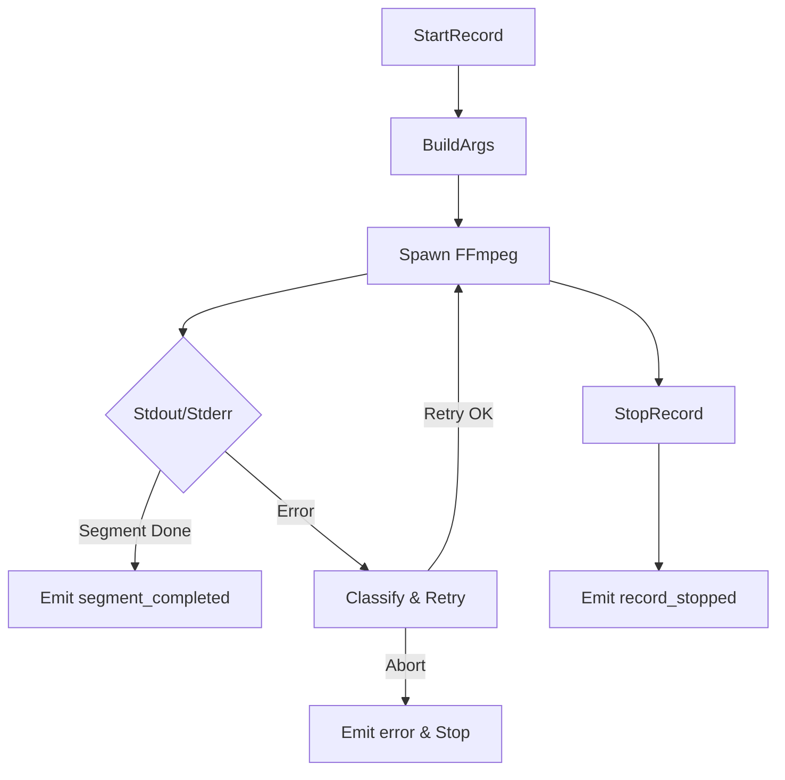
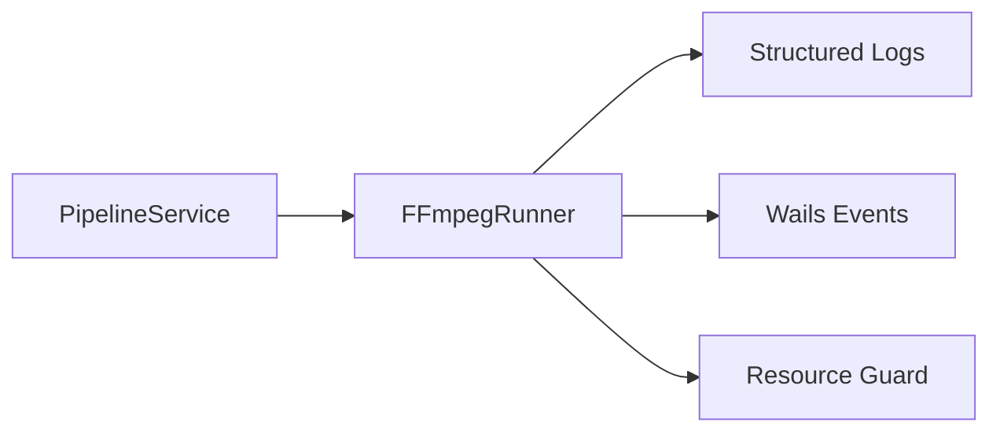
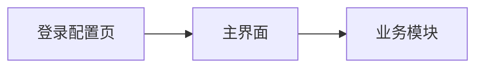

# 抖音解析迁移与FFmpeg闭环、登录GUI与性能压测实施计划（详细版）

## 项目概述
- 目标：基于 Wails v2.6+（Go 1.21+）重构现有 Python/JS 录制器，前端采用 Vue 3（可切换 React 18），实现 GUI 化与跨平台交付（Windows/Linux/macOS）。
- 兼容：保留现有 INI 配置与键名（含 `${key_name}` 渲染），原行为与接口保持一致；提供向下兼容适配与回滚路径。
- 性能与质量：RPC 端到端 `p95 < 50ms`，接口响应时间缩短 ≥30%，内存占用降低 ≥20%，≥300 测试用例覆盖，72h 稳定性验收。

## 体系架构与技术栈概览
- 前端：Vue 3 + Vite + TypeScript + WailsJS（IPC）。
- 后端：Go 1.21+，分层与 SOLID：`domain`（数据模型），`app`（用例服务），`infrastructure`（HTTP/FFmpeg/JS/配置），`adapter/wails`（IPC）。
- 关键组件：`SpiderService/ConfigService/AuthService/RecorderService/PipelineService`；`FFmpegRunner`、`JSEngine`（goja/Node 子进程）。

```mermaid
flowchart LR
  FE[Vue3 GUI] -- wails IPC --> AD[Adapter/Wails]
  AD --> APP[App Services]
  APP --> SPIDER[SpiderProvider]
  APP --> SELECTOR[StreamSelector]
  APP --> FF[FFmpegRunner]
  APP --> CFG[ConfigService]
  APP --> AUTH[AuthService]
  SPIDER --> JS[JSEngine(goja/Node)]
  SPIDER --> HTTP[HTTP Client(HTTP/2, Proxy)]
  FF --> OS[Exec + Logs + Events]
```

---

## 1. 抖音解析迁移（优先）
### 1.1 当前解析系统架构与技术栈
- Python `src/spider.py`：多平台解析（抖音/TikTok/…），通过 `requests/httpx` 访问，解析房间信息与播放源（`m3u8/flv`）。
- JS 签名：`PyExecJS` 调用 `src/javascript/x-bogus.js` 等，用于抖音/咪咕等风控参数计算；依赖本地 Node 环境。
- 配置与 Cookie：从 `config/config.ini` 读取账号、Cookie/Authorization、代理等；`URL_config.ini` 管理直播间地址。
 - 录制编排：`main.py` 构建 FFmpeg 命令、分段与转码、推送事件。

#### 架构分析表
| 模块 | 现状技术 | 职责 | 依赖 | 迁移关注点 |
|---|---|---|---|---|
| 解析器 | Python + requests/httpx | 抓取页面/API，解析房间/源 | Cookie/UA、JS签名 | 字段对齐、风控适配 |
| JS签名 | PyExecJS + Node | x-bogus等签名计算 | Node运行时 | 引擎替换与回退 |
| 配置 | INI 文件 | 账号/Cookie/Authorization/代理 | 磁盘文件 | `${key_name}` 渲染与写入 |
| 编排 | CLI + 线程 | 构建FFmpeg命令与录制流程 | ffmpeg二进制 | 并发与状态管理 |

### 1.2 迁移目标与约束
- 目标：将抖音解析迁移到 Go，接口保持：`FetchRoomInfo(url) (RoomInfo, error)`；字段对齐：`is_live/anchor_name/title/platform/play_url_list/m3u8_url/flv_url/quality`。
- 约束：保留 `${key_name}` 渲染与 INI 键名；维持旧行为（质量选择、代理策略、HTTPS/HTTP 回退）。

### 1.3 迁移步骤与时间节点
| 阶段 | 内容 | 产出 | 负责人 | 工期 |
|---|---|---|---|---|
| P1 | 抖音解析器原理与接口梳理 | 解析设计说明 | 后端 | 2d |
| P2 | `JSEngine` 接入（goja）与 Node 回退 | JS 引擎封装与测试 | 后端 | 3d |
| P3 | HTTP 客户端与 Cookie/UA 策略 | HTTP2/代理/重试实现 | 后端 | 2d |
| P4 | 抖音解析实现与字段对齐 | `DouyinSpider` 完整实现 | 后端 | 5d |
| P5 | 与 `SpiderService/Pipeline` 联调 | RPC 打通与延迟采样 | 后端/前端 | 2d |
| P6 | 回归与兼容验证 | 对比旧版结果与差异报告 | QA | 3d |

### 1.4 风险点与应对方案
| 风险 | 可能性 | 影响 | 应对措施 |
|---|---|---|---|
| 签名算法变更 | 中 | 解析失败 | JS 引擎支持脚本热更新与 Node 回退；签名缓存与版本化管理 |
| 风控/限频 | 高 | 降速/封禁 | 指数退避与多出口代理；UA/Headers 轮换；错误码识别与降级源返回 |
| Cookie 失效 | 中 | 无法解析 | `AuthService` 提供更新与校验；Keychain/DPAPI 安全存储 |
| HTTP2/网络抖动 | 中 | 延迟波动 | 连接池与重试策略；超时分级；独立采样告警阈值 |

### 1.5 详细实施步骤
- 设计迁移方案：输出`DouyinSpider`接口设计与状态机；确定字段映射与错误分类。
- 元数据提取：实现房间标题、主播名、状态、质量列表、播放源集合的解析器；对不同页面/接口版本兼容。
- 内容解析：整合签名参数（x-bogus）与API请求，支持多质量源与协议（m3u8/flv）。
- 数据完整性：字段校验与缺省值策略；异常降级返回可用源；持久化采样日志。
- 服务连续性：灰度开关与兼容模式（legacy子模块）；发现异常自动回退旧解析器。

### 1.6 迁移后的验证测试方案
- 单元测试：抖音解析成功/失败、风控码、Cookie 缺失、代理启用等；对齐字段与结构。
- 集成测试：`Pipeline` 端到端解析→选择→参数构造；对比旧 Python 结果（golden tests）。
- 性能测试：采样 `p50/p95/p99`，确保解析链路平均耗时降低 ≥30%。
- 稳定性：长跑 24h 抖动模拟，无崩溃与死锁，日志稳定。



---

## 2. FFmpeg 闭环实现
### 2.1 技术方案
- 进程管理：`exec.CommandContext` 启动 FFmpeg；捕获 `stdout/stderr`，按等级记录日志。
- 参数构造：`FFmpegRunner.BuildArgs(task)`，支持分段（`-f segment/-segment_time`）、格式 TS/MP4/MKV/FLV、音频模式等。
- 事件推送：在 Wails 构建下通过 `runtime.EventsEmit` 推送 `record_started/segment_completed/record_stopped/error`（构建标签隔离）。
- 容错与重试：错误分类（网络/协议/写盘/空间不足），阶梯式重试与告警；资源回收与安全退出。

#### 集成与处理步骤
1. 集成FFmpeg：通过可配置路径探测与版本校验；无则提示安装/下载。
2. 自动化流水线：Pipeline 解析→选择→参数构造→Runner 启动→分段事件→转码（可选）→后处理脚本→推送通知。
3. 错误监控：实时解析stderr，映射为错误类型（网络/丢包/权限/空间不足）；重试策略（退避、最大次数、熔断）。
4. 日志与追踪：结构化日志字段（task_id、platform、quality、bitrate、segment_seq、error_code）。
5. 资源守护：磁盘空间预检查（阈值+预警）、协议白名单、代理注入；停止流程确保进程与文件句柄释放。

### 2.2 闭环处理流程设计


### 2.3 性能指标与验收标准
| 指标 | 目标 |
|---|---|
| IPC 延迟（p95） | < 50ms |
| 录制启动时间（p95） | < 1.5s |
| 长跑内存占用 | 降低 ≥20% |
| I/O 稳定性 | 丢帧率 < 0.1% |
| 错误恢复 | 可自动恢复 ≥95% 的短暂网络错误 |

#### 验收用例
- 启停一致性：连续启停100次无资源泄漏；事件序列正确。
- 分段完整性：分段文件时间误差 ≤1s，丢段率 <0.1%。
- 重试可靠性：模拟网络抖动，自动恢复比例 ≥95%。

### 2.4 架构图（模块）


---

## 3. 登录 GUI 开发
### 3.1 用户界面原型
- 页面：登录配置（账号/Cookie/Authorization）→ 主界面（任务列表/日志/推送状态）→ 业务模块（解析/录制）。
- 组件：敏感键遮蔽显示、快捷校验与保存、错误提示与回退。



### 3.2 开发排期与里程碑
| 里程碑 | 内容 | 产出 | 负责人 | 工期 |
|---|---|---|---|---|
| M1 | 登录页原型与 API 对接 | 可交互原型 + RPC 调用 | 前端 | 3d |
| M2 | 敏感键写入与遮蔽 | 完整 CRUD + 校验 | 前端/后端 | 2d |
| M3 | 主界面日志/事件 | 事件订阅与展示 | 前端 | 2d |
| M4 | 与 Pipeline 联动 | 解析/录制一键链路 | 前端/后端 | 3d |

### 3.3 UI/UX 设计规范
- 一致性：色板/间距/字体统一；暗/亮模式适配；响应式布局。
- 交互：表单校验、错误提示、确认保存；可撤销与二次确认。
- 可访问性：键盘导航、对比度、ARIA 标签。

### 3.4 安全认证机制
- 存储：Keychain（macOS）/DPAPI（Windows）/Secret Service（Linux）。
- 日志：敏感信息脱敏；仅末尾 4 位展示；最小权限访问。
- 校验：写入前校验格式与可用性（Cookie/Token）；失败回退与提示。
- 多因素认证（MFA）：
  - 方案：TOTP（如 Google Authenticator）本地生成与验证；或系统级二次确认（macOS TouchID / Windows Hello 可选）。
  - 流程：登录成功后触发二次验证；失败回退提示与锁定策略；记住设备（可选，带有效期）。
  - 安全：密钥加密保存（平台秘钥服务），防重放与暴破保护。

---

## 4. 性能压测实施
### 4.1 压测方案
- 场景：RPC 并发调用（解析/计划/录制控制）、事件推送订阅、长时录制稳定性；代理启用与网络抖动。
- 工具：JMeter（HTTP/IPC 封装），pprof（CPU/内存），自研采样器（p50/p95/p99）。

### 4.2 压测场景与指标
| 场景 | 并发 | 目标QPS | 指标 |
|---|---:|---:|---|
| FetchRoomInfoRPC | 50 | ≥100 | p95<50ms、错误率<0.5% |
| PlanRecordRPC | 50 | ≥100 | p95<50ms、错误率<0.5% |
| Start/StopRecordRPC | 20 | ≥40 | 启停成功率100%、启动p95<1.5s |
| 事件推送 | 100 订阅 | —— | 无漏推送、延迟<100ms |

### 4.2 指标与成功标准
| 指标 | 成功标准 |
|---|---|
| IPC 延迟分布 | p95 < 50ms，p99 < 80ms |
| 吞吐 | 每秒 RPC ≥ N（按业务） |
| 错误率 | < 0.5% |
| 内存占用 | 降低 ≥20% |
| 稳定性 | 72h 无崩溃/死锁/泄漏 |

### 4.3 压测环境配置要求
- 硬件：8C16G / NVMe；网络可控抖动；独立代理出口。
- 软件：Go 1.21+、Wails v2.6+、FFmpeg 最新稳定版；Node（如需 JS 子进程）。
- 部署：容器化运行（可选），日志持久化与分级轮转。

### 4.4 数据收集与分析方法
- 采样：方法入口/出口记录耗时（p50/p95/p99）；事件队列统计；错误分类与比例。
- 分析：JMeter 报表 + pprof 火焰图；日志聚合（按模块/等级）；回归对比旧版本。
 - 报告：输出总体与分场景报表，附关键图表（延迟分布、吞吐曲线、资源占用）。

---

## 实施时间表与责任人分配
| 序号 | 任务 | 负责人 | 计划开始 | 计划结束 | 依赖 |
|---|---|---|---|---|---|
| 1 | 抖音解析迁移设计 | 后端 | D1 | D2 | 架构评审 |
| 2 | JS 引擎接入与回退 | 后端 | D3 | D5 | 1 |
| 3 | HTTP 客户端策略 | 后端 | D6 | D7 | 1 |
| 4 | 抖音解析实现 | 后端 | D8 | D12 | 2,3 |
| 5 | Pipeline 联调与采样 | 前/后端 | D13 | D15 | 4 |
| 6 | FFmpeg 闭环实现 | 后端 | D16 | D22 | 5 |
| 7 | 登录 GUI 第一阶段 | 前端 | D16 | D20 | 5 |
| 8 | IPC 优化与监测 | 前/后端 | D21 | D24 | 6,7 |
| 9 | 测试扩充与压测 | QA | D22 | D28 | 6,7,8 |
| 10 | 稳定性 72h 验收 | QA | D29 | D31 | 9 |

> 说明：D1 起按自然日连续；实际日期以项目排期为准。

## 工程质量与合规
- 静态分析：CI 集成 `go vet`、`golangci-lint`（开启 `errcheck`, `govet`, `staticcheck`, `ineffassign`, `gofmt` 等规则）；PR 必须零错误与零警告或明确豁免说明。
- 代码审查：PR 模板检查项——函数级注释、SOLID 遵循、测试覆盖≥85%、性能影响评估、兼容性与回滚说明、安全项（脱敏/密钥存储/输入校验）。
- 安全合规：OWASP ASVS Level 2 检查清单映射到实现与验证步骤；密钥最小化访问与审计。

## 文档与交付清单
- 文档：API 迁移指南、性能优化白皮书、压测与稳定性测试报告、架构设计说明书、接口规范文档。
- 可执行：Windows/Linux/macOS 二进制；安装包 DEB/RPM/DMG。
- 测试报告：JMeter 并发与长时压测结果；72h 稳定性结论。

## 验收标准汇总
- 功能：抖音解析功能与录制闭环一致性；GUI 登录管理可用。
- 性能：端到端交互平均响应缩短 ≥30%，内存占用降低 ≥20%，IPC `p95 < 50ms`。
 - QPS：各场景达成目标（Fetch/Plan ≥100 QPS，Start/Stop ≥40 QPS）。
- 测试：≥300 用例覆盖；集成与长跑稳定；压测指标达标。
- 安全：通过 OWASP ASVS Level 2 检查。

## 风险管理与回滚策略
- 兼容模式：GUI 提供 legacy 子模块切换；解析与录制均可回退。
- 变更管控：关键模块灰度发布与可观测性增强；问题时快速回滚到上一个稳定版本。

## 备注
- 默认前端栈 Vue 3；若需 React 18，保持架构不变仅替换模板与组件库。
- 所有实现遵循 SOLID；函数级注释完备；日志与错误处理采用统一策略。
